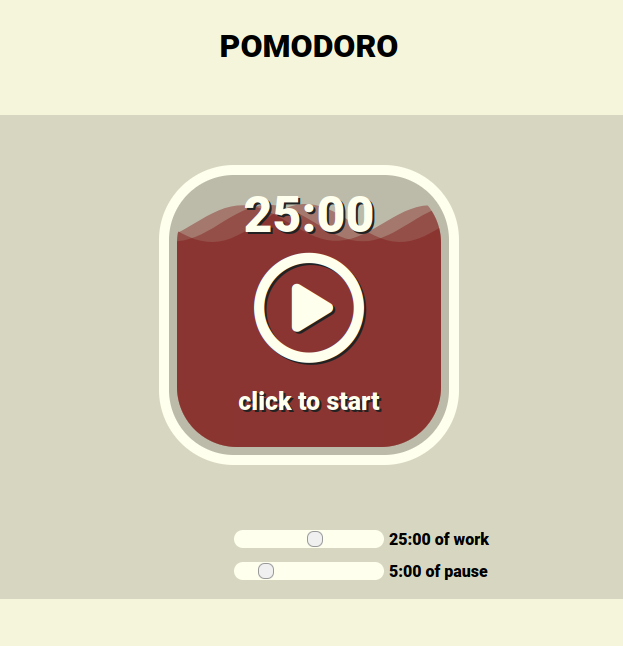
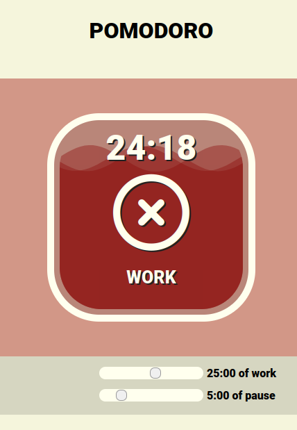
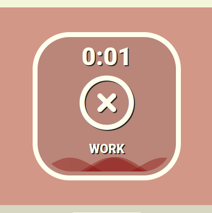
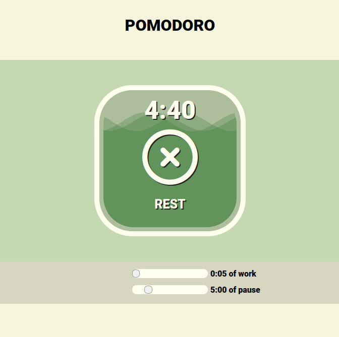

# Pomodoro !

A simple and stylish Pomodoro Timer web app designed to boost your productivity effortlessly.

## About

This web app was developed as a small school project for the Resource R3-01 at the University of Caen Normandy. It implements the Pomodoro Technique, a time management method that encourages work in focused intervals, traditionally 25 minutes in length, separated by short breaks. It's an effective way to enhance your productivity and maintain concentration.

## Features

- Automatic cycling between WORK and REST periods.
- Customizable timer durations with two sliders.
- Settings are saved in your local storage.
- Beautiful visual representation: A bottle filled with tomato juice that empties during intervals and turns green during breaks.
- Intuitive and user-friendly design.

## Getting Started

Just click the link below to start using the Pomodoro Timer web app:

[**Start Pomodoro Timer**](https://moustave.github.io/pomodoro/)

## Screenshots

## Usage

1. Adjust the timer durations using the sliders.
2. Click the on the bottle to begin the timer.
3. Focus on your work during the WORK interval.
4. Enjoy a well-deserved break during the REST interval.
5. You can reset the timer by clicking the on the bottle again !

## Tech Stack

- HTML
- CSS
- JavaScript

## License

This project is open-source and free to use.